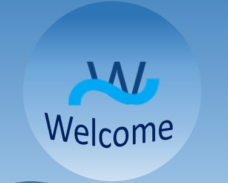

<h1 align="center">MathGame</h1>
<h6 align="center">Mission Impossible</h6>

 

## 🖥 Team Members:
** Dobril Peev - Scrum Trainer **  
** Vicho Vichev - Frontend Developer **  
** Martin Nenkov - Backend Developer **  
** Nikola Paskov - QA engeneer **

 

## 🚀 Languages and tools:

 

     

## 📋 Description:

*The game is created to improve peoples math knowledge and to help them memorise more numbers and work faster. 

 

